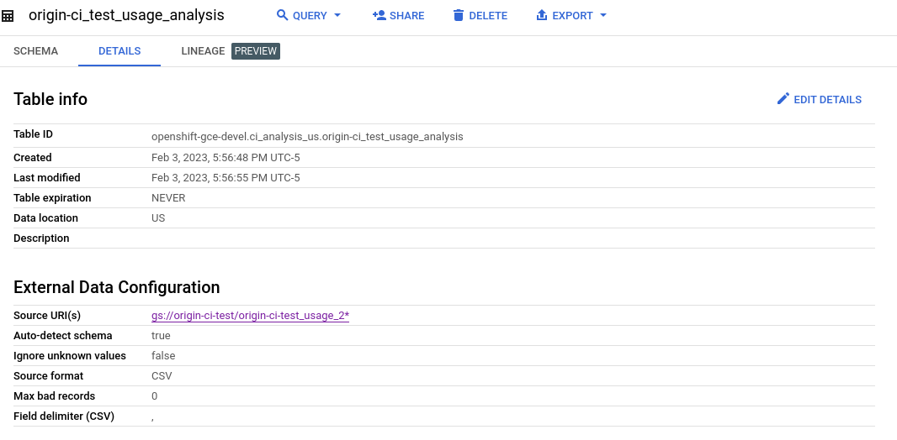

# prowjobs-to-bigquery
Tooling to extract details from historical CI GCS files / logs and populate them into bigquery for CI Utilization Cost analysis

# Updates
- Installed in openshift-gce-devel account as a Cloud Function. Paste and update directly in console.

# Joins
Example join for materialized view:
```
SELECT * EXCEPT(schema_level) FROM `openshift-gce-devel.ci_analysis_us.ci_operator_logs` INNER JOIN `openshift-gce-devel.ci_analysis_us.jobs` USING (prowjob_build_id)
```

# Bulk load
- Setup native table which contains access logs for test-platform-results bucket. This is what the cold load system will read to find files of interest. You used a native table since external table would fail if corrupt CSVs existed.
  - Use source of "Google Cloud Storage"
  - Pull from files: `test-platform-results-access-logs/_usage_2024_*`
  - Auto detect schema
  - Tolerate some errors
  - CSV
  - 

Delete some of the unnecessary content from the analysis table (NOTE MICROS not millis, add 000 to epoch):
```
DELETE FROM `openshift-gce-devel.ci_analysis_us.origin-ci-test_usage_analysis` WHERE time_micros < 1664582400000000 OR cs_method NOT IN ("PUT", "POST") or cs_user_agent = "GCS Lifecycle Management"
```                                                                                                
- 
- Change schema_version in gcs_finalize_event.py
- Setup massive system in GCE running debian (e.g. n2-highcpu-96) - configure to runs as aos-kettle.
- sudo apt install python3 python3-pip
- sudo pip install google-cloud-storage google-cloud-bigquery future lxml
- Upload model.py and gcs_finalize_event.py to /loader
- chmod +x gcs_finalize_event.py
- ulimit -n 5000
- ./gcs_finalize_event.py
